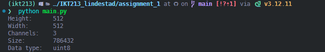

# Assignment 1


This assignment loads an image (Lena) and prints basic image information, and saves simple webcam information to a text file.

**Files:**

- Image: [assets/img/lena.png](assets/img/lena.png)
- Screenshot: [assets/img/step_4_printout.png](assets/img/step_4_printout.png)
- Camera info output: [solutions/camera_outputs.txt](solutions/camera_outputs.txt)
- Python script: [main.py](main.py)

## Step IV Screenshot



## Step V Camera Outputs

Text file at [solutions/camera_outputs.txt](solutions/camera_outputs.txt) contains:

```text
fps: 30
height: 480
width: 640
```

## Run with Pixi

```powershell
pixi install
pixi run python assignment_1/main.py
# optional GUI test
pixi run python tests/show_camera.py
```

## Run with uv (virtualenv)

```powershell
# from repo root
uv venv .venv
# Then activate the virtual environment (command printed by uv)
uv sync
python assignment_1/main.py
```

## Run with Anaconda/conda

```powershell
conda create -n ikt213 python=3.12 -y
conda activate ikt213
pip install opencv-python numpy
python assignment_1/main.py
```

## Links

- Lena image: [assets/img/lena.png](assets/img/lena.png)
- Printout screenshot: [assets/img/step_4_printout.png](assets/img/step_4_printout.png)
- Camera outputs: [solutions/camera_outputs.txt](solutions/camera_outputs.txt)
