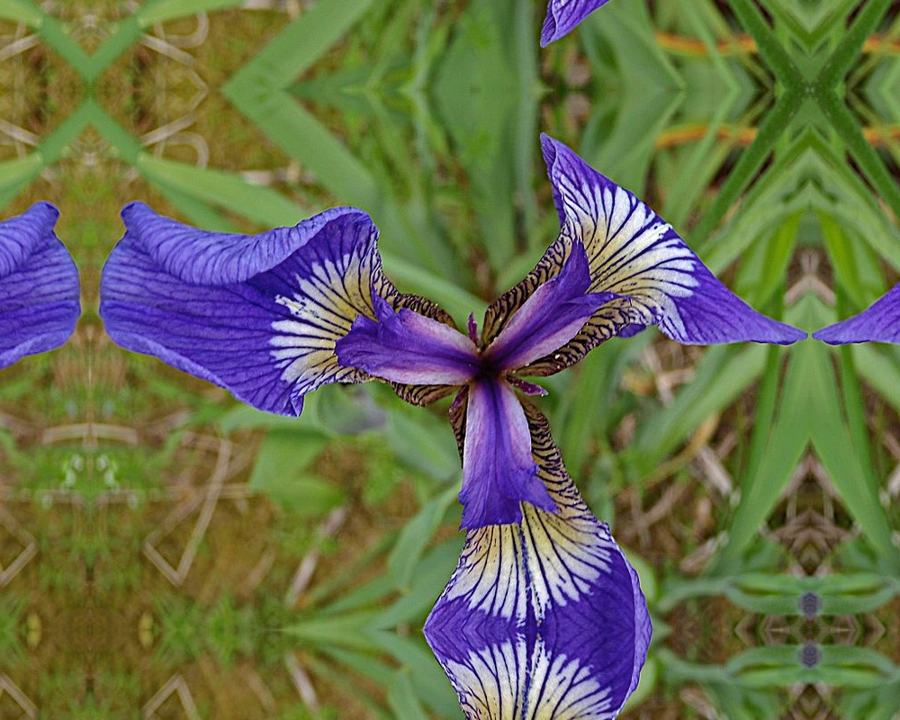
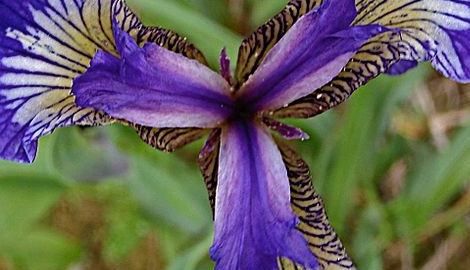
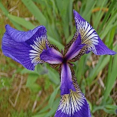
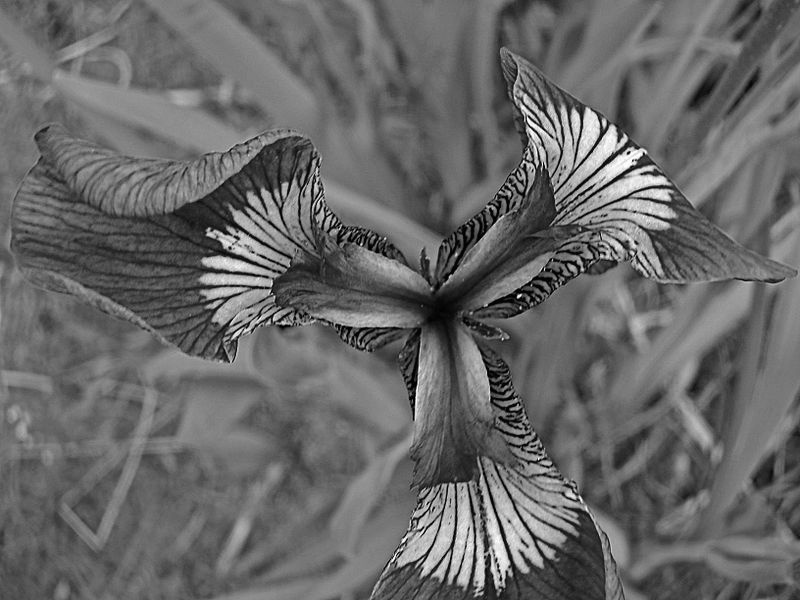
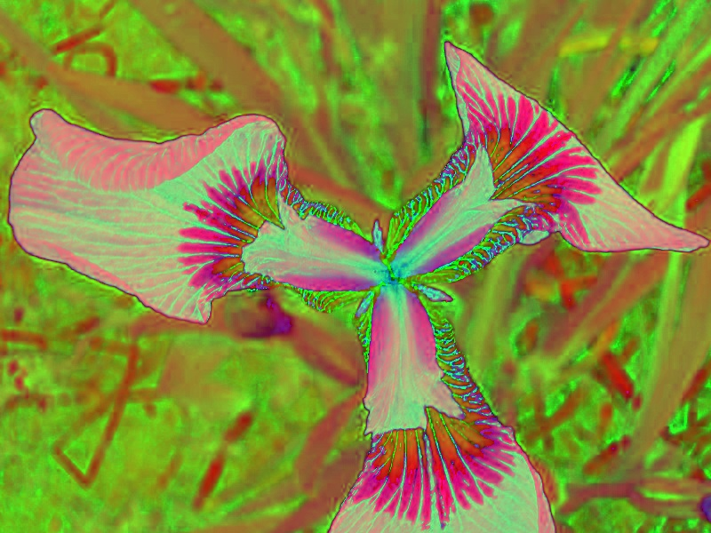
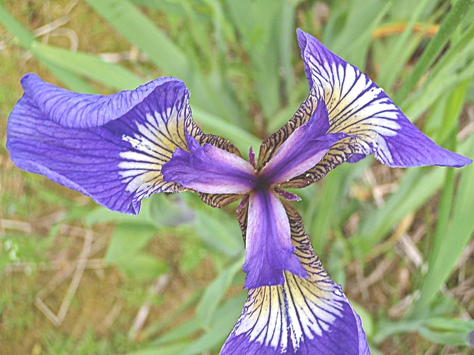
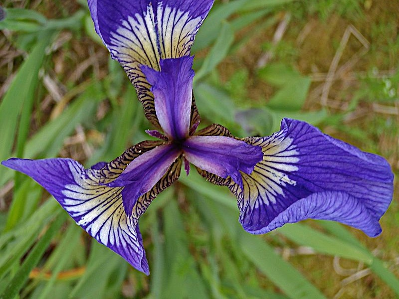

# Assignment 2

## II. Image operations

Run `uv run 2.py` from the `solutions` directory. With an activated environment, `python 2.py` works as well. The generated images are saved in the current directory.

### 1. Padding

A 100 pixel border which reflects the edges of the original image.

### 2. Cropping

Crop 200 pixels from the left and top, and 130 pixels from the bottom and right.

### 3. Resize

Resize the image to 200x200 pixels.

### 4. Manual copy

Copy the pixels into an empty NumPy array without using a copy function.

### 5. Grayscale

Convert the image to grayscale. OpenCV loads the image in BGR order, so the conversion uses `COLOR_BGR2GRAY`.

### 6. HSV

Convert the image from BGR to HSV. The saved image shows the HSV channels directly, so the displayed colors differ from the original.

### 7. Color shifting

Add 50 to all three color channels. Convert to a signed integer type before adding, then limit the values to 0-255 so they don't wrap around.

### 8. Smoothing

Blur the image using a Gaussian filter with a 15x15 kernel and the default border.

### 9. Rotation

The function supports 90 degrees clockwise and 180 degrees. The saved image is rotated 180 degrees.

