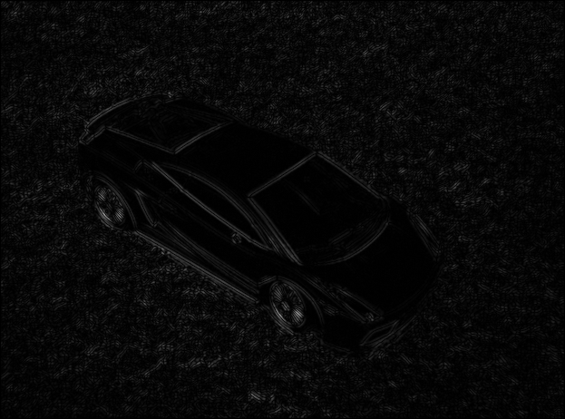
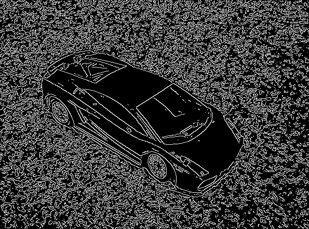
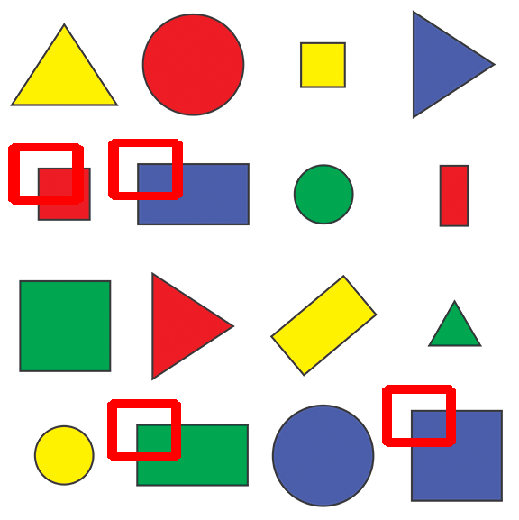
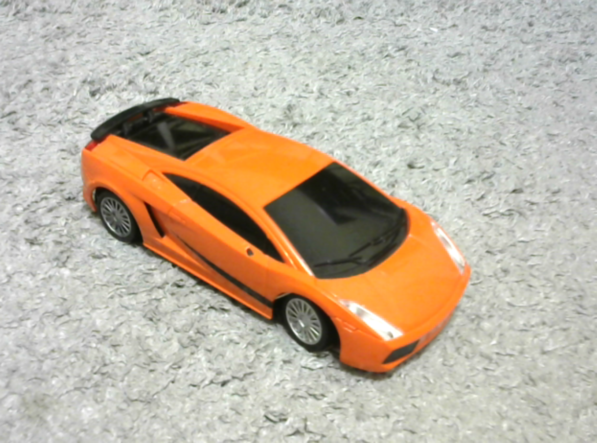
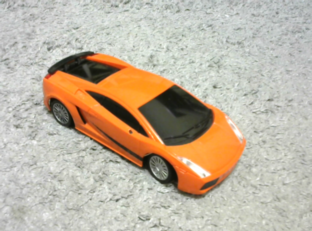

# Assignment 3

## II. Edge detection, resampling, and template matching

Run `uv run 2.py` from the `solutions` directory. With an activated environment, `python 2.py` works as well. The generated images are saved in the current directory.

### 1. Sobel edge detection

Convert the Lamborghini image to grayscale and blur it using a 3x3 Gaussian kernel with sigmaX=0. Apply Sobel with dx=1, dy=1 and ksize=1, then convert the absolute edge values to uint8 for saving.

### 2. Canny edge detection

Use the same grayscale conversion and Gaussian blur, then apply Canny with both thresholds set to 50.

### 3. Template matching

Match `shapes_template.jpg` against the supplied `shapes.png`. Convert both images to grayscale for matching with `TM_CCOEFF_NORMED`, then mark matches with a score of at least 0.9 using red rectangles on a copy of the color image.

### 4. Resizing

Use image pyramids with scale_factor=2 to double or halve the image dimensions. The function also supports other powers of two by repeating the pyramid step. When downscaling an odd dimension, OpenCV rounds up.

