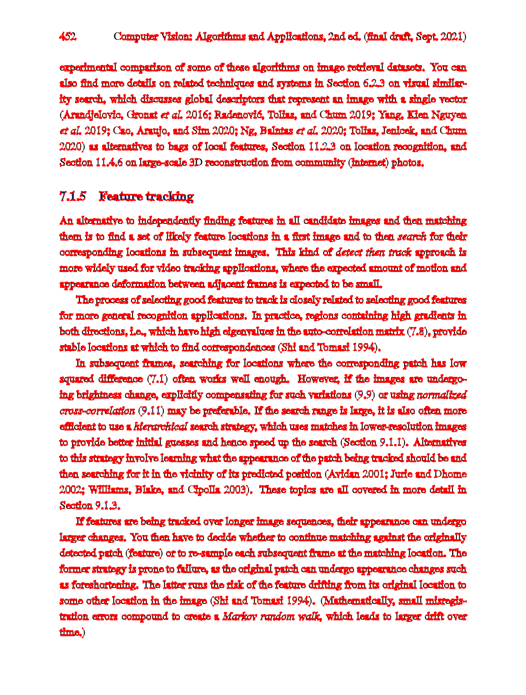
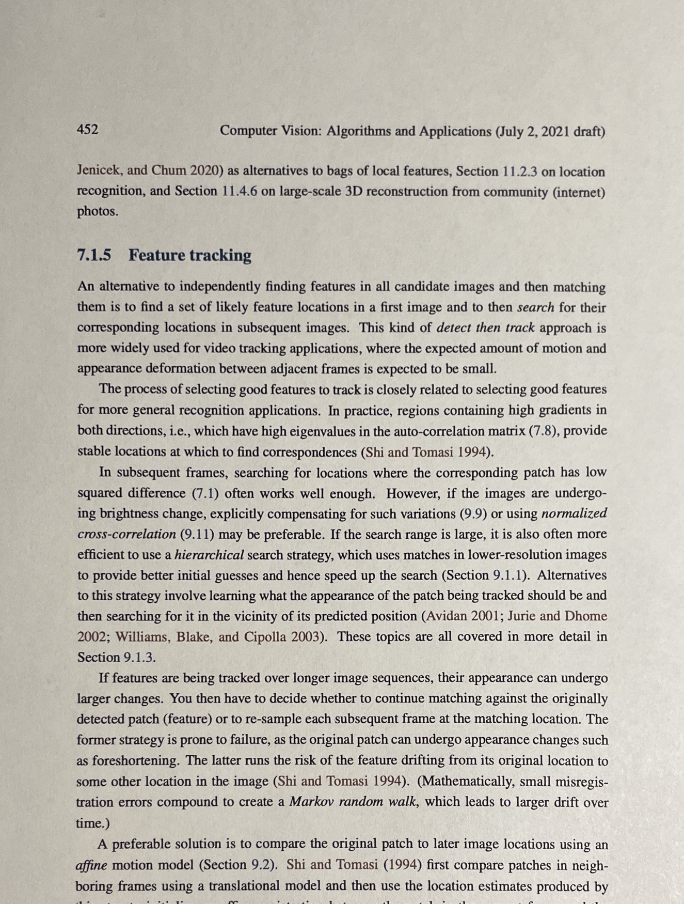

# Assignment 4

## II. Harris corner detection and image alignment

Run `uv run 2.py` from the `solutions` directory. With an activated environment, `python 2.py` works as well. The generated images are always saved beside the script in `solutions`, regardless of the current directory.

### 1. Harris corner detection

Convert the reference image to grayscale and float32, then use `cornerHarris()` with blockSize=2, ksize=3 and k=0.04. Dilate the result and mark corners above 1% of the maximum response in red.

### 2. Feature-based image alignment

Approach used: **SIFT with FLANN**.

Detect SIFT features in both images and match their descriptors with FLANN. Use max_features=10 as the minimum number of good matches, following the SIFT tutorial, and good_match_precent=0.7 for the ratio test.

Estimate a homography with RANSAC and warp the photo to the reference image dimensions. The matches image shows only the matches accepted by RANSAC, with green lines between corresponding features.

### PDF output

After generating the images, run `uv run create_pdf.py` from the `solutions` directory. The PDF dependency is installed by `uv sync`.

The [output PDF](solutions/assignment_4.pdf) is also saved in `solutions`. It contains the Harris image on page 1, the aligned image on page 2, and the matches image on page 3. The alignment method is noted on page 2.

### References

- [Harris Corner Detection](https://opencv24-python-tutorials.readthedocs.io/en/latest/py_tutorials/py_feature2d/py_features_harris/py_features_harris.html)
- [Feature Matching + Homography to find Objects](https://docs.opencv.org/4.x/d1/de0/tutorial_py_feature_homography.html)
